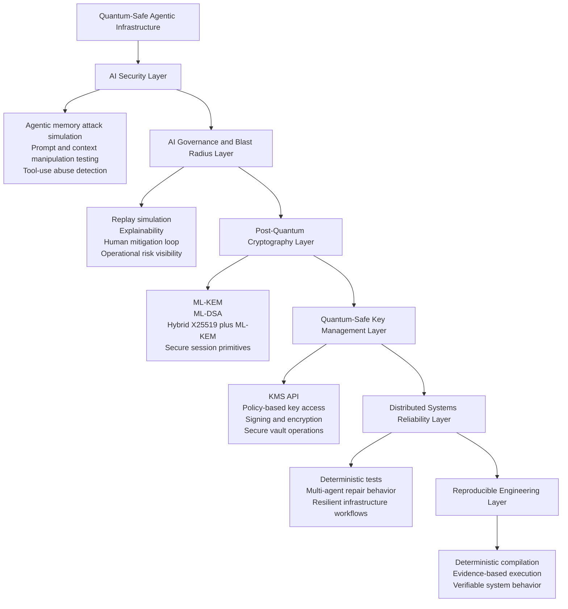

# Reference Architecture

Quantum-Safe Agentic Infrastructure can be viewed as a layered architecture.

## High-Level Layered Architecture

## Architecture Goal

The goal is to design infrastructure that remains trustworthy when AI agents, quantum threats, cryptographic systems, financial workflows, and distributed platforms converge.
